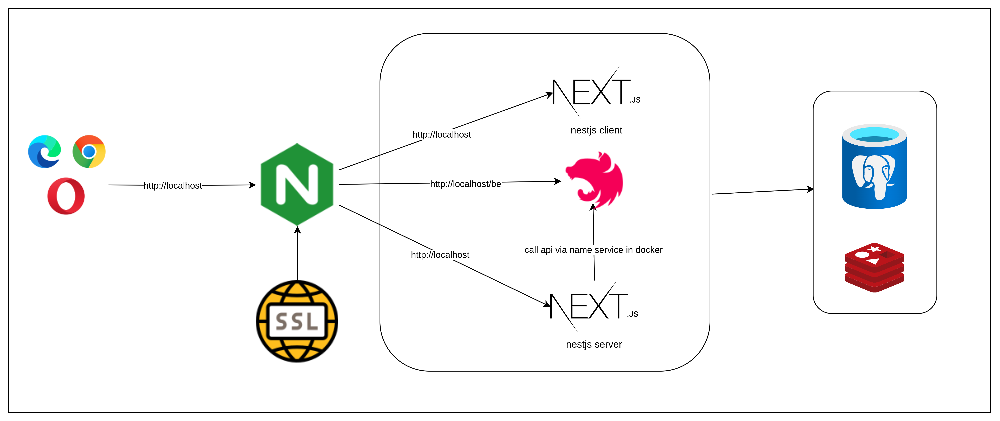

# An Nhien: E-commerce for Essential Oils

<br />
<div align="center">
    

 <h3>An Nhien - E-commerce built as part of a university course</h3>
  <p align="center">
   Built with TypeScript and modern web technologies
</div>
<br />

[](https://github.com/ducvui2003/ecommerce/actions/workflows/server-ci.yml)
[](https://github.com/ducvui2003/ecommerce/actions/workflows/web-ci.yml)
[](https://github.com/ducvui2003/ecommerce/actions/workflows/telegram.yml)

## 🛠️ Technologies and Frameworks

- **Node.js** v22
- **Frontend**: Next.js (App Router), Shadcn UI, Tailwind CSS v4
- **Backend**: NestJS, Prisma, Zod
- **Database**: PostgreSQL, Redis

## 🧱 Development architecture



## 📁 Folder Structure

```bash
.
├── server/              # Backend (NestJS)
├── web/                 # Frontend (Next.js)
├── docker/
│   └── local/           # Docker setup
```

## Getting Started

### Run with Docker

1. Clone the repo

   ```bash
   git clone https://github.com/ducvui2003/ecommerce.git
   cd ecommerce
   ```

2. Move to docker folder
   ```bash
   cd ./docker/local
   ```
3. Setup env inn `.env`

   Copy and configure your environment variables as needed.

4. Run docker compose

   ```bash
   chmod +x run-local.sh && ./run-local.sh
   ```

## Contact

- **Author:** [Le Anh Duc](https://github.com/ducvui2003)
- **License:** MIT
- **Repository:** [github.com/ducvui2003/ecommerce](https://github.com/ducvui2003/ecommerce)
- **Last Updated:** June 2025

---

<p align="center">
  <sub>
    Built with ❤️ by <a href="https://github.com/ducvui2003">Duc Vui</a> • MIT License • Updated June 2025
  </sub>
</p>
