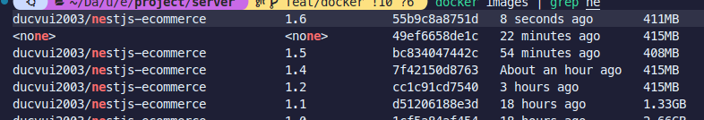

# Dockerfile changes

## v1.4

- Sử dụng `gcr.io/distroless/nodejs22-debian12:latest   ` cho final stage, size: 144MB

- Image size: 415MB

## v1.5

- Sử dụng `node:22-alpine` cho final stage, size: 158MB

- Sử dụng `npm ci --omit=dev` để cài các dependencies

- Image size: 408MB

## v1.6

- Sử dụng node-prune để remove các file không cần thiết của lib trong node_modules, node_module từ lần build trước giảm từ 315MB -> 282MB

- Image size: 411MB

## Dependencies

````
"@keyv/redis": "^4.3.2",
"@nestjs/cache-manager": "^3.0.1",
"@nestjs/common": "^11.0.1",
"@nestjs/core": "^11.0.1",
"@nestjs/event-emitter": "^3.0.1",
"@nestjs/jwt": "^11.0.0",
"@nestjs/mapped-types": "\*",
"@nestjs/platform-express": "^11.0.1",
"@nestjs/swagger": "^11.0.5",
"@prisma/client": "^6.3.1",
"@react-email/components": "^0.0.33",
"@types/nodemailer": "^6.4.17",
"argon2": "^0.41.1",
"cache-manager": "^6.4.1",
"class-transformer": "^0.5.1",
"class-validator": "^0.14.1",
"date-fns": "^4.1.0",
"dotenv": "^16.4.7",
"import": "^0.0.6",
"ms": "^2.1.3",
"nestjs-zod": "^4.3.1",
"nodemailer": "^6.10.0",
"react": "19.0.0",
"react-dom": "19.0.0",
"reflect-metadata": "^0.2.2",
"rxjs": "^7.8.1",
"swagger-ui-express": "^5.0.1",
"uuid": "^11.1.0",
"zod": "^3.24.2"```
````
